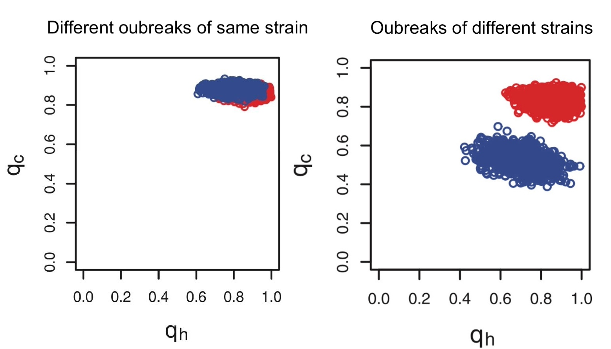
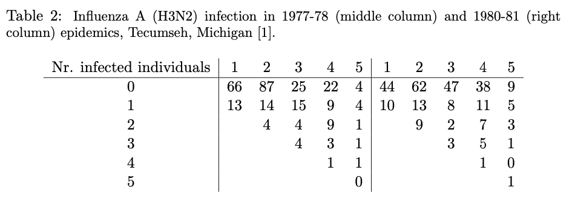
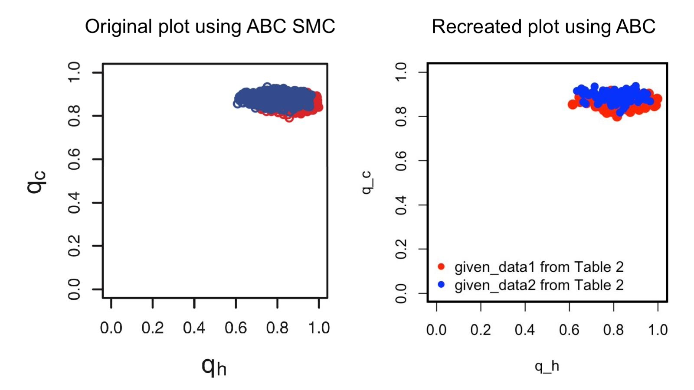
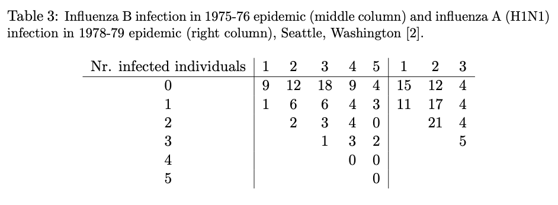
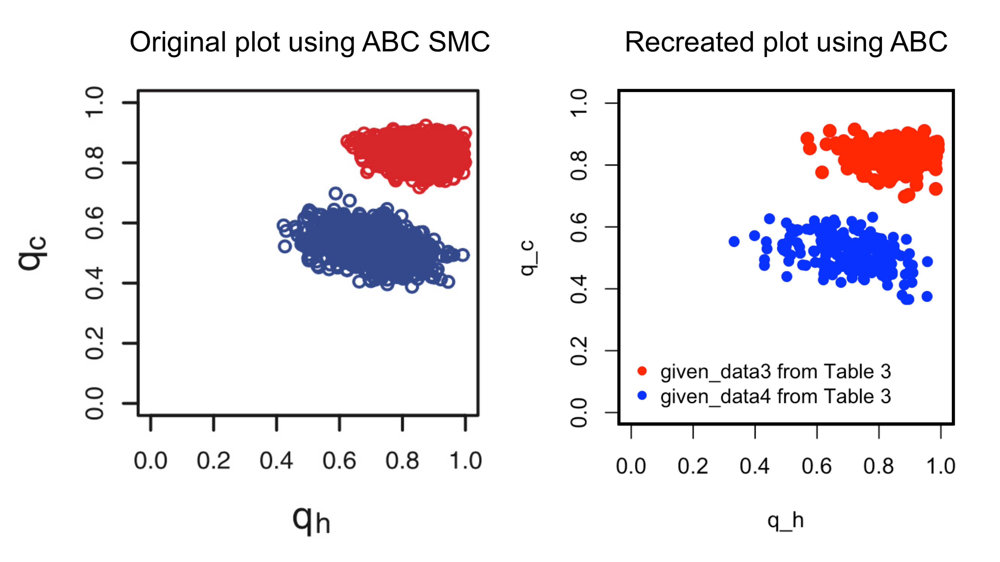

  
---

```{r setup, include=FALSE}
knitr::opts_chunk$set(echo = TRUE, warning = FALSE, message = 'hide')
```

## Background 

. . .

**Why Approximate Bayesian Computation (ABC)?**

- Simulation-based approach for fitting models to data.

- Allows parameter estimation without explicit likelihood calculations.

. . .

**Project Overview:**

- This project is based on the work of [Tony and Stumpf, 2010](https://watermark.silverchair.com/bioinformatics_26_1_104.pdf?token=AQECAHi208BE49Ooan9kkhW_Ercy7Dm3ZL_9Cf3qfKAc485ysgAAA3swggN3BgkqhkiG9w0BBwagggNoMIIDZAIBADCCA10GCSqGSIb3DQEHATAeBglghkgBZQMEAS4wEQQMjV15kHzFknWstbVZAgEQgIIDLvGZcFAgMxJ2FtxTGrsPvkAoO-imsFvwyY2RJRbPWpz_WYOR3ZYIIXnJpmCp_pOOlhB9fGwvPCCBNkFN7jjQvo-jtSs3vYGT9U9ABO1ngcGxGq0M_-xfz5QDNcfLJpdHphXjvXPmNQKw-FbmW7Z-lM4VADhWgRMXeAa69IcQWbf3O3M4YVlAfOhNibTRLt8QLpayutZlbZAwX6aC2a13wmjnKF6Vx3WJWazbewssqJov9CmNXprFKUqnhcq1QLZ4oaGSKYaxVFpmwB2ZylzUBbliQ3fYN6VRAfleLXrmyvOymid2GtXNnhrslyx6SN2OSgbXU0YIgfSgCk5OaCETsFY7VMGzLCuUTB776n6hDJKcZ-Hb7RelIJxLeOZteaxRVOiu-a9pG5NbQQuueQtS0C-kqHlVksEwUAucqzS9UXX3ucvmsIgYK-jQQ8jmtqPTjVkdFGhR1J3LzOw7VJCJQy4b_a_WZLDNS7bskxvvZgU7DOZAVHxYu1aPUHh3UaeJ-5oMwJ-sqFWg_6ZruUPk4L9f1KB1siRgSmxw-Eo4JHKXjSEsIXAylD3m_trgxEIxkeqgXFJ867U-qJxeG39ToS9BptAG_IGK-HfMD0ovPK9mKHXvrp32fRO5S0oiqaCMa8kV4DGwbZjaMArJDV9Ps3WNw_EE2E8m7J4UjiqLNQkihUtUM6d4xmJ-S4zo-qPJkr0ajWkDhQwkeJ1wsaYGXItivcoAB4lzyQmG3Zs5kQQIIa2m4hveEf2mDlglHMoPHTAN5hGG-9_LegexhFcKAZTguF4nNpozqAVsIQaj8DeAaHWY8AvjP5HjDTgYHs4ni3w7EjULGDSroFhBndTpCAMNjtY9yIqoh248Bf7ayWtBCXUx1yJyIamAPGeHej3nPnf80TACr2Of6fJicQ-hFcdVGzQj8qiq8b9GuOFFJ43SnZudftdAwwlA0mQb30ZhvgJvsYngGY752-NegVEd2F_r6N2Jkw-G-fzEnoObf6OXzGaYlNSq4_s4vGnQ38HGe_HPk7fdDIESUA35j1SbK5K83274IWvReND0Byubb2MmgZ4fJ90sCCKnjLeu9ho).

- Sec 3.3 of the paper seeks to answer whether there is evidence to support using the same model to study:

. . .
 
a) The spread of the same strains of a virus in different years (Influenza A (H3N2) in 1977-78 and in 1980-81, Michigan)

. . .

b) The spread of different viruses in different years (Influenza A in 1978-79 and Influenza B in 1975-76, Washington)

- To do so, the authors use Approximate Bayesian Computation for model selection based on a Sequential Monte Carlo sampler (ABC SMC).

## Results from the Paper

Their results related to these questions are summarized by the following figures.

{width=80%}

- $q_c$ is the probability of an individual not being infected by the community
- $q_h$ is the probability of an individual not being infected by their household
- Red and blue represent different outbreaks of the viruses

## Our Goal

- Use Approximate Bayesian Computation (ABC) to explore the same questions and produce similar plots
- Estimate the 4 epidemiological parameters $(q_{c1},q_{h1},q_{c2},q_{h2})$ using past outbreak data 

. . .

The 4-parameter model describes the hypothesis that each outbreak has its own characteristics
  
---  

## Model Setup and ABC Algorithm


**Inputs:**

- 4-parameter vector: $q = (q_{c1}, q_{h1}, q_{c2}, q_{h2})$
where $(q_{ci}, q_{hi})$ are the infection (household/community) avoidance rates for the two outbreaks

. . .

- Probability $w_{js}$, that $j$ out of the $s$ susceptible individuals in a household become infected 

. . .

- Similarity measure: The average Frobenius distance between the simulated and observed data for the two outbreaks

$$d(D_{obs}, D^*) = \frac{1}{2} \left( \| D_1 - D^*(q_{c1}, q_{h1}) \|_F + \| D_2 - D^*(q_{c2}, q_{h2}) \|_F \right)$$
where $\|A\|_F = \sqrt{\sum_{i,j}|a_{ij}^2|}$ is the Frobenius norm.

. . .


**The Algorithm:**

- Drawing parameters $q^{(i)}$ from a prior distribution : $P(q) \sim \text{Uniform}[0,1]$ 

- Simulating data using a probabilistic model : $D^*(q^{(i)}) := D^*|q^{(i)} \sim w_{js}$

- Computing distance between simulated and observed data : $d(D_{obs}, D^*(q^{(i)}))$

- Accepting/rejecting parameter samples based on the above distance, given a tolerance level $\epsilon$:

  - **Accept** the sample $q^{(i)}$ if $d(D_{obs}, D^*(q^{(i)})) < \epsilon$
  - **Reject** otherwise

. . .

The accepted parameter values approximate the posterior distribution $P(q|D_{obs})$.


## Design and Workflow

We created functions to generate:

. . .

- The probability matrix $(w_{js})_{j,s}$ generating function `W_js_matrix`
- The data generating function `simulate_household_data`
- The average Frobenius distance computing function `distance`
- The posterior sample generating function `generate_abc_sample`

. . .

```{r, echo = F, warning = F, message = 'hide'}  
## Project Design

# Load the DiagrammeR library
library(DiagrammeR)

# Generate and export the diagram directly
grViz("
digraph ABC_process {
  node [shape = box, style = filled, fillcolor = lightblue]
  
  Prior_Distribution [label = 'prior_distribution() \\nGenerates prior parameters \\n(q_c, q_h)']
  W_js_Matrix [label = 'W_js_matrix() \\nTakes q_c, q_h, household_size \\nGenerates W_js matrix']
  Simulate_Data [label = 'simulate_household_data() \\nTakes W_js, household_size, n_households \\nGenerates simulated data']
  Distance_Function [label = 'Distance Function \\nComputes Frobenius norm between datasets']
  Generate_ABC_Sample [label = 'generate_abc_sample() \\nTakes given_data1, given_data2, \\nDistance, prior_distribution, \\nsimulate_household_data, epsilon']
  Posterior_Samples [label = 'Posterior Samples \\nUsed to estimate parameters']
  
  Prior_Distribution -> W_js_Matrix [label = '  q_c, q_h']
  W_js_Matrix -> Simulate_Data [label = '  W_js, household_size, n_households']
  Simulate_Data -> Distance_Function [label = '  Simulated Data, Observed Data']
  Distance_Function -> Generate_ABC_Sample [label = '  Distance']
  Generate_ABC_Sample -> Posterior_Samples [label = '  Posterior Samples']
}
")
```  

  
## Probability Function

The following function takes input (q_c, q_h, household_size) and returns the probability matrix as per the formula

$$w_{js} = \binom{s}{j}w_{jj}(q_cq_h^j)^{s-j}\, \, , s = 1,2,\dots \, \, , j = 0, 1, \dots , s$$
where $w_{0s} = q_c^s$ for $s = 0,1,2,\dots$ and $w_{ss} = 1 - \sum_{j = 0}^{s-1}w_{js}$.

. . .

```{r}
# Function to compute w_js matrix for a given outbreak
W_js_matrix <- function(q_c, q_h, household_size) {
  
  # Throw error if q_c or q_h is not a probability
  if ((q_c < 0) || (q_h < 0) || (q_c > 1) || (q_h > 1)) {
    stop(paste("Invalid inputs:", "q_c =", q_c, "b =", q_h, "; Probabilities must be between 0 and 1."))
  }
  
  nCol <- household_size      # Columns (susceptible individuals) indexed by s = 1,..., household_size
  nRow <- household_size + 1  # Rows (infected individuals) indexed by j = 0, 1,..., s
  
  # Initialize a (zero) matrix to store the probabilities w_js
  w_js_matrix <- matrix(0, nrow = nRow , ncol = nCol)
  
  for (s in 1:nCol) {  # Iterate over number of susceptible individuals in a household
    for (j in 0:s) {   # Iterate over number of infected individuals
                       # j corresponds to row (j + 1) of the w_js matrix
      if (j == 0) {    
          w_js_matrix[j + 1,s] <- q_c^s   
      } else if (j < s) {                 
          w_js_matrix[j + 1, s] <- choose(s, j) * w_js_matrix[j + 1, j] * (q_c * q_h^j)^(s - j)
      } else {                           
          w_js_matrix[j + 1, s] <- 1 - sum(w_js_matrix[1:j,s])
      }
    }
  }
  
  rownames(w_js_matrix) <- paste("j =", 0:household_size)
  colnames(w_js_matrix) <- paste("s =", 1:household_size)
  
  return(w_js_matrix)
}
```

## Tests for `W_js_matrix`

We performed tests to check if our function `W_js_matrix` works as expected. 

. . .

- The function throws an error for bad parameters, e.g. $q_c$ or $q_h$ are not probabilities, or household_size is negative

- The function works as expected for simple cases, e.g. $q_c = q_h = 0$ or $q_c = q_h =1$

- The columns of the matrix output should in fact sum up to 1

. . .

```{r, echo = F, warning=F, message='hide'}
library(testthat)
```

```{r}
test_that("W_js_matrix throws error for bad parameters", {
  expect_error(W_js_matrix(0.5, -0.1, 4))        # Negative q_h
  expect_error(W_js_matrix(2, 0.9, 3))           # q_c > 1
  expect_error(W_js_matrix(0.3, 0.2, -7))        # household_size not a positive integer
})

test_that("W_js_matrix works for simple cases", {
  # q_h = q_c = 0 
  W0 <- W_js_matrix(0,0,3)
  expected_W0 <- matrix(c(0,0,0,
                         1,0,0,
                         0,1,0,
                         0,0,1), ncol = 3, byrow = T)
  expect_equivalent(W0, expected_W0)            # expect_equal will fail because of attribute comparison 
                                                # W0 has rownames and colnames, while expected_W0 does not
  # q_h = q_c = 1 
  W1 <- W_js_matrix(1,1,4)
  expected_W1 <- matrix(c(1,1,1,1,
                         0,0,0,0,
                         0,0,0,0,
                         0,0,0,0,
                         0,0,0,0), ncol = 4, byrow = T)
  expect_equivalent(W1, expected_W1)            # W1 has rownames and colnames, while expected_W1 does not
})
  
test_that("W_js_matrix columns sum to 1", {
  for (i in 1:100) {                            # Test for 100 random cases
    q_c <- runif(1, 0, 1)                       # Choose q_c randomly between 0 and 1
    q_h <- runif(1, 0, 1)                       # Choose q_h randomly between 0 and 1
    household_size <- sample(1:10, 1)           # Choose household_size randomly between 1 and 10

    W <- W_js_matrix(q_c, q_h, household_size)
    
    expect_equivalent(colSums(W), rep(1, ncol(W)))   
  }
})
```


## Data Simulating Function

The function below takes as inputs the parameters $q_c$, $q_h$, (maximum) household size, and the number of households (for each household size, as a vector), and returns a matrix of simulated data according to the distribution `W_js_matrix(q_c,q_h,household_size)`. 

. . .

The simulation is carried out by sampling the number of infected individuals for each household size and storing their counts in a matrix.

. . .

```{r}
simulate_household_data <- function(q_c, q_h, household_size, n_households) {
  
  # Throw error if user doesn't provide number of households for each household size
  if (length(n_households) != household_size) {
    stop("Invalid inputs: length(n_households) does not match (maximum) household_size.")
  }
  
  w_js_matrix <- W_js_matrix(q_c, q_h, household_size)
  
  nCol <- household_size      # Columns (susceptible individuals) indexed by s = 1,..., household_size
  nRow <- household_size + 1  # Rows (infected individuals) indexed by j = 0, 1,..., s
  
  # Initialize a (zero) matrix to store the simulated data
  simulated_data <- matrix(0, nrow = nRow, ncol = nCol)
  
  for (s in 1:nCol) {                           
                                          
    probabilities <- w_js_matrix[1:(s + 1), s]    # (j+1) corresponds to row j of w_js_matrix
    
    # Simulate household infections using random sampling
    samples <- sample(0:s, size = n_households[s], replace = TRUE, prob = probabilities)
    
    # Count the occurrences of each infection level
    counts <- table(factor(samples, levels = 0:s))
    
    # Store the simulated counts in the matrix
    simulated_data[1:(s + 1), s] <- as.numeric(counts)
  }
  
  rownames(simulated_data) <- paste("(Infected) j =", 0:household_size)
  colnames(simulated_data) <- paste("s =", 1:household_size)
  
  return(simulated_data)
}
```

## Example of a simulated dataset

The following is an example of a simulated dataset, given parameters 

- $q_c = 0.8$ 
- $q_h = 0.6$
- (maximum) household_size = 5 
- n_households = (100, 100, 100, 100, 100), i.e. 100 households of each household size 1, 2, .. 5

```{r}
q_c <- 0.8                                # Probability of avoiding community infection
q_h <- 0.6                                # Probability of escaping household infection
household_size <- 5                       # Maximum number of susceptible individuals in a household
n_households <- rep(100,5)                # 100 households for each household size

simulated_data <- simulate_household_data(q_c, q_h, household_size, n_households)
print(simulated_data)
```

## Tests for `simulate_household_data`

We also did sanity checks for this function.

. . .

- The function throws an error for bad parameters, e.g. $q_c$ or $q_h$ are not probabilities

- The function works as expected for simple cases, e.g. zero number of households for a household_size

- Number of infected individuals doesn't exceed number of susceptible individuals


```{r}
test_that("simulate_household_data throws error for bad parameters", {
  expect_error(simulate_household_data(0.5, -0.1, 3, c(12,10,6)))   # Negative q_h
  expect_error(simulate_household_data(1.4, 0.8, 4, c(12,10,6,3)))  # q_c > 1
  expect_error(simulate_household_data(0.3, 0.4, 6, c(100,90,8)))   # length(n_households) != household_size 
})

test_that("simulate_household_data works for simple cases", {
  # 0 number of households for household size 3 should return third column 0
  data.0 <- simulate_household_data(0.1, 0.8, 4, c(12,8,0,10))

  expect_equivalent(data.0[,3], rep(0,nrow(data.0)))  
})
  
test_that("simulate_household_data doesn't have more infected than susceptible", {
  q_c <- runif(1, 0, 1)                          # Choose q_c randomly between 0 and 1
  q_h <- runif(1, 0, 1)                          # Choose q_h randomly between 0 and 1
  household_size <- sample(1:10, 1)              # Random household size between 1 and 10
  n_households <- sample(1:100, household_size)  # Random n_households vector of size household_size 
  
  result <- simulate_household_data(q_c, q_h, household_size, n_households)
  
  # Validate that entries for j > s are 0
  for (j in 1 : nrow(result)) {             
    for (s in 1 : ncol(result)) {           
      if (j-1 > s) {                             # j corresponds to row (j-1)
        expect_equivalent(result[j, s], 0)    
      }
    }
  }
})
```

## Implementing ABC 

We define a simple function which takes a pair of given datasets and simulated datasets (for each outbreak)

and computes the average Frobenius distance.

```{r}
frobenius_norm <- function(A) return(sqrt(sum(A^2)))
distance <- function(given_data1, given_data2, simulated_data1, simulated_data2){
  distance1 = frobenius_norm(given_data1-simulated_data1)
  distance2 = frobenius_norm(given_data2-simulated_data2)
  total_distance = (distance1+distance2)/2
  return(total_distance)
}
```

. . . 

**Generating Posterior Samples:**

We then generate posterior samples $q^{(i)}$ by defining a function that takes the pair of observed data, a distance, a prior distribution for the parameter, a data-simulating function, and a tolerance level.

```{r}
generate_abc_sample <- function(given_data1, given_data2,
                                distance,
                                prior_distribution,
                                data_simulating_function,
                                epsilon) {
    while(TRUE) {
        q <- prior_distribution()
        
        q_c1 <- q[1]
        q_h1 <- q[2]
        q_c2 <- q[3]
        q_h2 <- q[4]
        
        household_size1 <- ncol(given_data1)
        n_households1 <- colSums(given_data1)
        
        simulated_data1 <- data_simulating_function(q_c1, q_h1, household_size1, n_households1)
        
        household_size2 <- ncol(given_data2)
        n_households2 <- colSums(given_data2)
        
        simulated_data2 <- data_simulating_function(q_c2, q_h2, household_size2, n_households2)
        
        if(distance(given_data1, given_data2, simulated_data1, simulated_data2) < epsilon) {
            return(q)
        }
    }
}
```

## What is considered a reasonable $\epsilon$?

Given the Supplementary data to the paper (below), we chose a threshold level of $\epsilon = 15$.


{width=80%}

. . .

- Our datasets represent **counts** of households, each table having 20 entries. 

. . .

- By design, these counts are always **positive integers**. 

. . .

- If 5 of the 20 entries are identical and remaining 15 differ by only 1, the Frobenius distance becomes 15. 

. . .

- (Unnormalied) Frobenius distance in case of integer entries is **highly sensitive** to small changes. This scale justifies setting $\epsilon = 15$ as a reasonable threshold.

## ABC in action

```{r}
prior_distribution <- function() runif(n = 4, min = 0, max = 1)     
```

. . .

The code below produces 100 parameter samples that are accepted by the algorithm with $\epsilon = 15$. This was a computationally expensive process and took about 2 hours to run on RStudio.

. . .

```{r, include=FALSE, echo = FALSE, results='hide'}
# DO NOT RUN THE CELL BELOW THIS ONE!
# It will take forever. Have already run it and saved the output as RDS to access it again.
# Otherwise it creates problems in knitting and tries to draw samples again.  
```

```{r long-computation, eval=FALSE}
# Generating 100 posterior samples
posterior_samples <- replicate(n = 100,
    generate_abc_sample(given_data1, given_data2, distance,
                        prior_distribution, simulate_household_data, epsilon = 15))
```


```{r, include=FALSE, echo = FALSE, results='hide'}
# Save posterior_samples_Table2.rds on your local machine (from Drive) before running this
# saveRDS(posterior_samples, "posterior_samples_Table2.rds")
posterior_samples <- readRDS("posterior_samples_Table2.rds")
```

Here are a few posterior samples from the 100 generated above.

```{r}
posterior_samples[, 95:100]
```

We now extract individual parameters $q_{c1}$, $q_{h1}$, $q_{c2}$ and $q_{h2}$ from the samples to plot them. 

```{r}
# Extracting samples of parameters q_c1, q_h1, q_c2, q_h2 from the posterior samples
q_c1 <- posterior_samples[1, ]  # First row for q_c1
q_h1 <- posterior_samples[2, ]  # Second row for q_h1
q_c2 <- posterior_samples[3, ]  # Third row for q_c2
q_h2 <- posterior_samples[4, ]  # Fourth row for q_h2
```

## Comparing the plots for Same Strain - Different Outbreak

After extracting the infection avoidance rates from sample parameter vectors, we plot $q_h$ vs $q_c$ using our ABC model and compare it to the authors' plot using ABC SMC.

. . .

{width=80%}

- Red represents Influenza A (H3N2) infection in 1977-78, Tecumseh, Michigan.

- Blue represents Influenza A (H3N2) infection in 1980-81, Tecumseh, Michigan.

## Comparing the plots for Different Strain - Different Outbreak

We perform a similar experiment with the different strain dataset (below).

{width=80%}
. . .

Since this is a smaller dataset, we were able to run 200 simulations and use a better tolerance of $\epsilon = 7$.


{width=80%}

- Red represents Influenza B infection in 1975-76, Seattle, Washington.

- Blue represents Influenza A (H1N1) infection in 1978-79, Seattle, Washington.

## Conclusion

- We were able to reproduce pretty similar results with a basic ABC algorithm.

. . .

- Same strain virus outbreaks did not differ in infection avoidance parameters.

. . .

- While parameters for different strain virus outbeaks somewhat varied.

. . .

- We need to perform more tests for our functions, but we got a visual check in form of our final plots.

## Thank You!!
